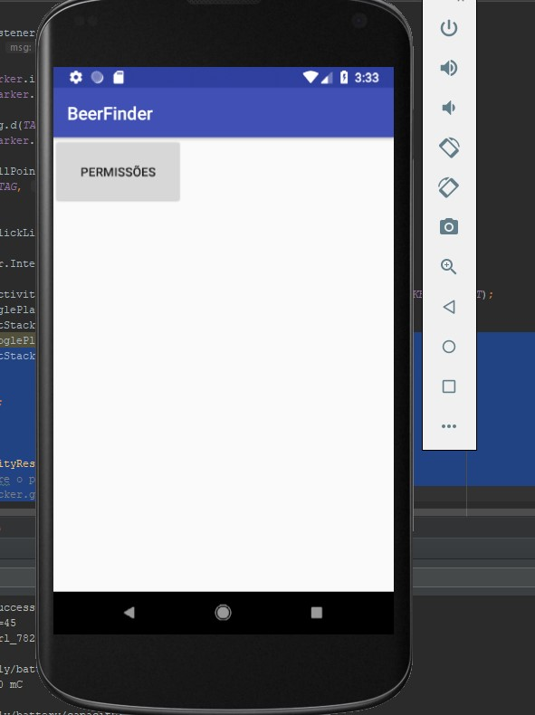
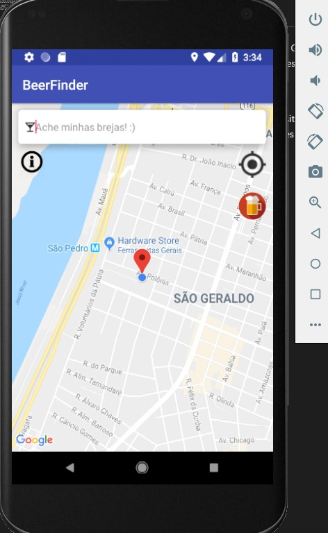
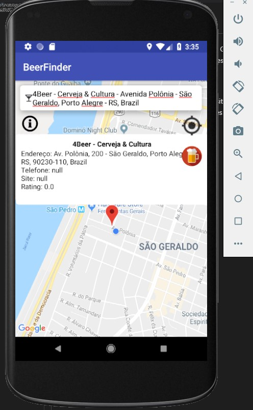
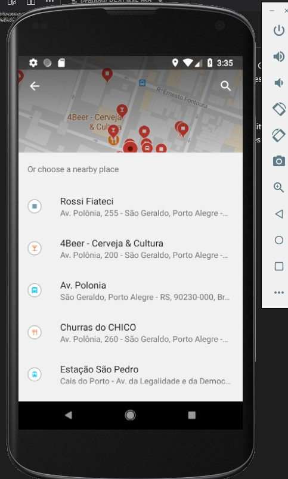

# BeerFinder :beers:
Trabalho realizado como atividade prática para o GB (2018/01) da disciplina de computação móvel e ubíqua. Consiste em uma simples aplicação de mapa, com as funcionalidades de pesquisa (com autocompletar), exibir restaurantes próximos e recentralização do GPS.

- Para rodar o trabalho é necessário:
    - Instalar o android studio;
    - Uma imagem de android (ou dispositivo) que contenha o Android a partir da versão 6.0;
    - Será necessário conceder permissões sobre a localização do dispositivo ao iniciar o App.

Algumas capturas de tela

Algumas funcionalidades ainda devem ser corrigidas, como a procura do **NearBy** (ultima tela), não entendi muito bem como fazer, mas vi que na existe uma issue aberta pela comunidade com um feature request para a classificação de locais [aqui](https://issuetracker.google.com/issues/35826944)

Um pequeno vídeo de demonstração pode ser acessado [aqui](prints/demo.webm)

Apesar do trabalho ter sido parcialmente realizado, achei a atividade muito interessante, pois nunca havia trabalhado tanto com API's e com aplicações para Android, fato que me deixou motivado a realizar novos experimentos após a conclusão do semestre :D
